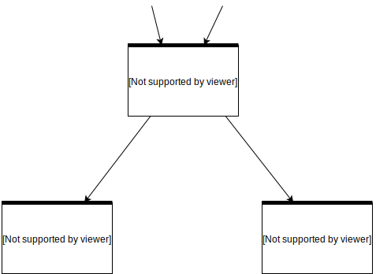
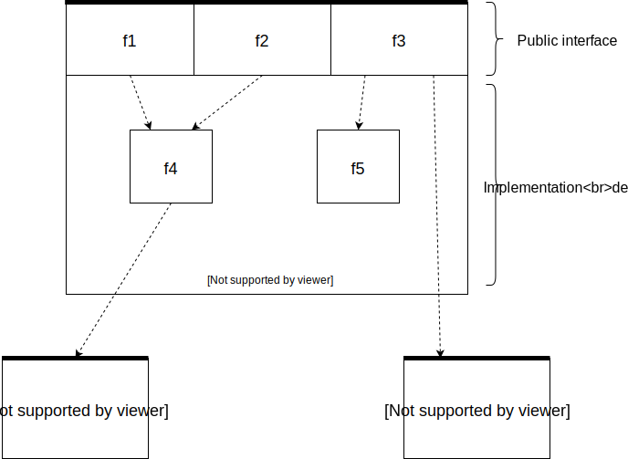

---
date: 2019-11-06
draft: false
title: Как полюбить coverage и писать надежные тесты
tags: ['python', 'testing', 'coverage', 'boo']
...

Все мы знаем что тесты это полезно, но мало кому нравится их делать.
Это достаточно творческий процесс, который зачастую сложнее чем написать
оригинальный код. В статье пойдет речь о том как организовать код тестов,
и как можно использовать coverage, чтобы процесс стал легче.

[TOC]

## Определения

## Чем отличаются юниты от интеграционных тестов

## Тестирование через публичные интерфейсы

## Зачем нужен coverage
